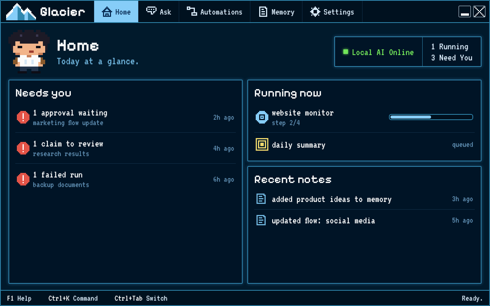
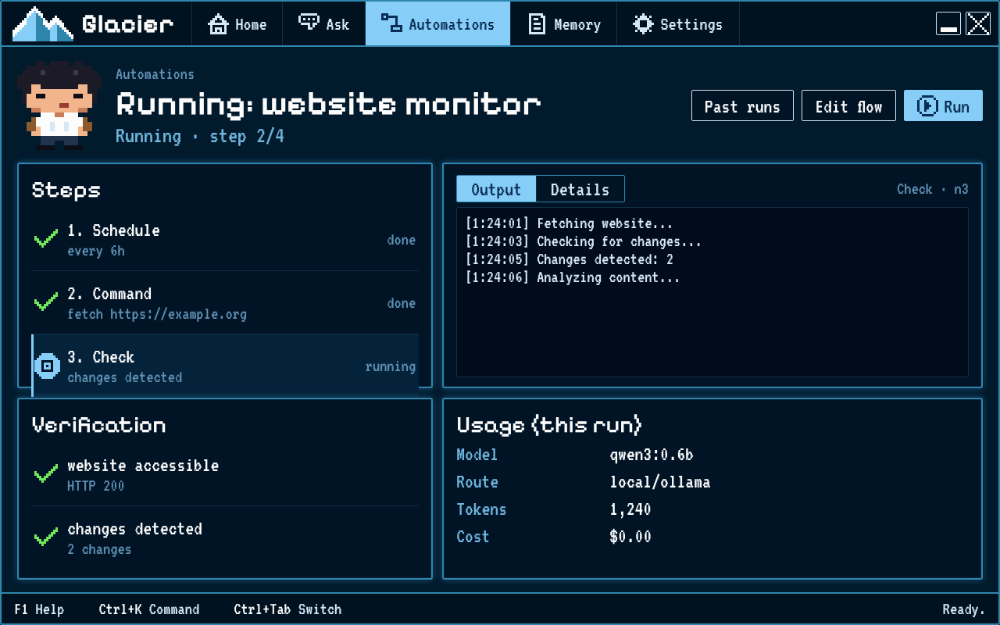
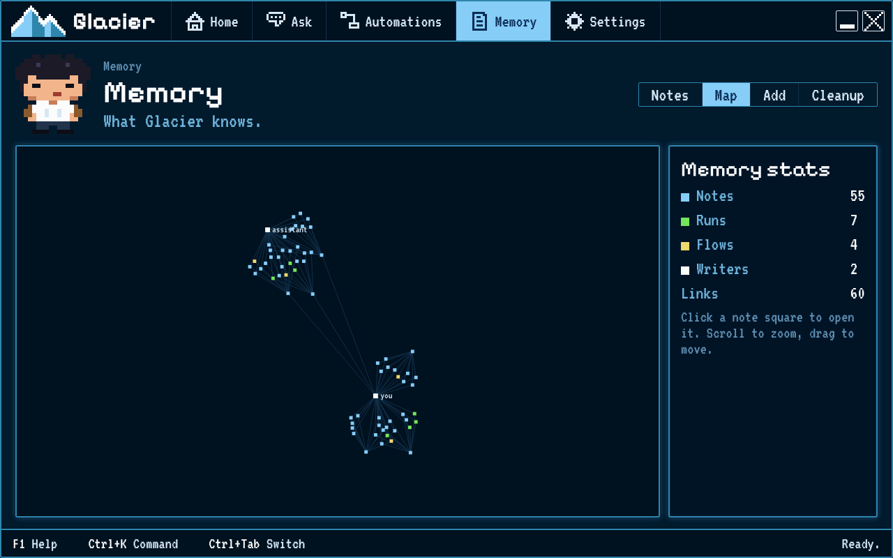
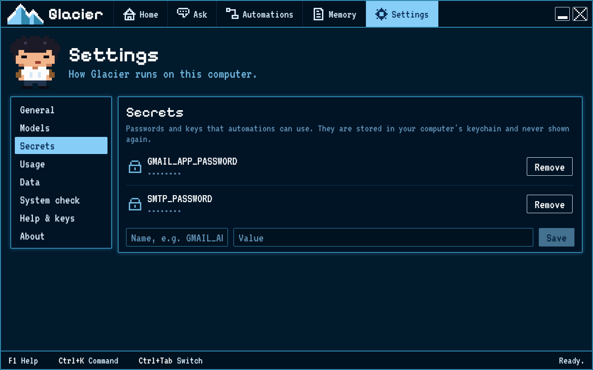

# Finding your way around

Glacier has five places along the top of the window: **Home**, **Build**, **Automations**, **Memory** and **Settings**.
Everything else opens inside one of them.

## Home

Home is today at a glance. **Needs you** lists what is waiting for you: an approval, a claim to review, or a failed run.
**Running now** shows what is working and how far along it is. **Recent notes** shows what was saved lately.
The box at the top right says whether your local AI is ready.

## Build

Build interviews you about a project, then prepares a spec and a team plan for you to review. Read [Build a project with a team](02-build-a-team.md) before approving a plan.

## Automations

Automations lists your flows. Press **New** to make one, or **Templates** to start from an example. The canvas lets you arrange steps and connect them.
Open a flow to see its steps, the output of each step, its checks and what it cost. The canvas has a minimap and an arrange-steps option.
**Past runs** lists earlier runs. **Undo** puts back what a run changed. **Edit flow** opens the full builder.

## Memory

Memory holds your notes. **Notes** lets you read, search and edit them; type `[[` to link one note to another.
**Map** draws everything Glacier knows and how it connects. **Add** brings in files, text or exported chats.
**Cleanup** suggests duplicates to merge and old notes to archive. Every change can be undone.

## Settings

Settings shows the AI engine, saved secrets, spending, and where your data lives. **Models** lets you switch engines and set an API spending cap. **System check** tells you which tools are ready on this computer. **About** has update details and release notes.

## Keys

Use the keyboard hints in the bar along the bottom of the window: **F1** opens Help, **Ctrl+K** opens the search menu, and **Ctrl+Tab** moves between places. On the start menu, **Up** and **Down** move the cursor, **Enter** chooses an item, and **Escape** returns to Home. **Alt+1** to **Alt+5** jump to a place.
