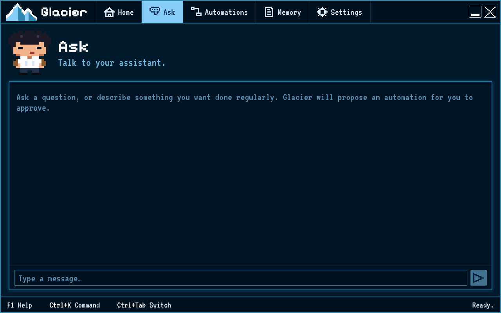

# Finding your way around

Glacier has five places, always along the top of the window: **Home**, **Ask**, **Automations**, **Memory** and **Settings**.
Everything else opens inside one of them.

## Home

Home is today at a glance. **Needs you** lists what is waiting for you: an approval, a claim to review, or a failed run.
**Running now** shows what is working and how far along it is. **Recent notes** shows what was saved lately.
The box at the top right says whether your local AI is ready.

## Ask

Ask is a chat with your assistant. Ask a question, or describe work you want done regularly.
When Glacier suggests an automation, you can **Approve** it, **Edit** it first, or **Reject** it.

## Automations

Automations lists your flows. Press **New** to make one, or **Templates** to start from an example.
Open a flow to see its steps, the output of each step, its checks and what it cost.
**Past runs** lists earlier runs. **Undo** puts back what a run changed. **Edit flow** opens the full builder.

## Memory

Memory holds your notes. **Notes** lets you read, search and edit them; type `[[` to link one note to another.
**Map** draws everything Glacier knows and how it connects. **Add** brings in files, text or exported chats.
**Cleanup** suggests duplicates to merge and old notes to archive. Every change can be undone.

## Settings

Settings shows the AI model in use, your saved secrets, what was spent, and where your data lives.
**System check** tells you which tools are ready on this computer.

## Keys

- **Ctrl+K** opens a box where you can type where to go or which flow to open.
- **Ctrl+Tab** moves to the next place. **Alt+1** to **Alt+5** jump straight to one.
- **F1** shows the keys.
