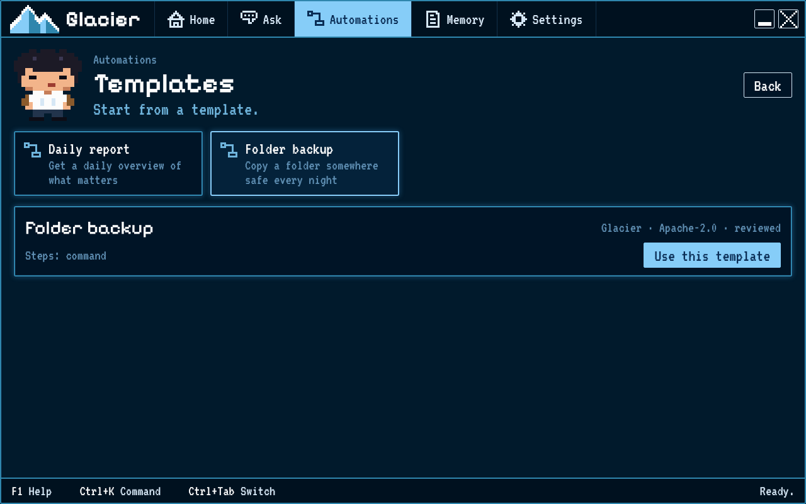

# Your first automation from a template

Choose a ready-made example, run it, and read its result.

## Steps

1. Open **Automations**.
2. Choose **Templates**.
3. Select a template. Read its name, description, and steps.
4. Choose **Use this template**. Glacier opens the new automation in the builder.
5. Choose **Run**. Wait while its steps finish.
6. Read **What happened** and the step results. If the run asks you to approve something, read the request before choosing **Approve** or **Reject**.
7. If the automation includes a note step, open **Memory** and choose **Notes**. Look for the newest note from the run.

## How you know it worked

The run says **Success**, and the **What happened** message describes the result. If the automation includes a note step, that note appears in Memory > Notes. A successful run with no checks may still be unverified; read the verification area before relying on the result.
