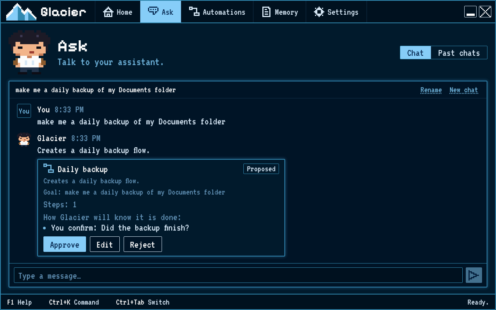

# Ask Glacier to make an automation for you

Tell Glacier about a small task and review its suggestion before accepting it.

## Steps

1. Open **Ask**.
2. In **Type a message…**, describe the task in everyday words. Say what you want done and what a good result looks like. Do not include passwords.
3. Choose **Send** and wait for Glacier to reply.
4. Read the proposed automation. Check that its goal matches what you asked for.
5. Read **How Glacier will know it is done**. This shows the check Glacier plans to use.
6. Choose **Approve** to accept the proposal, **Edit** to change it first, or **Reject** if you do not want it.
7. If you approved it, Glacier opens the automation in the builder. Review and save it before running.

## How you know it worked

The proposal shows its goal and at least one check before you accept it. After **Approve**, the automation opens in the builder; after **Edit**, its draft opens for changes.
