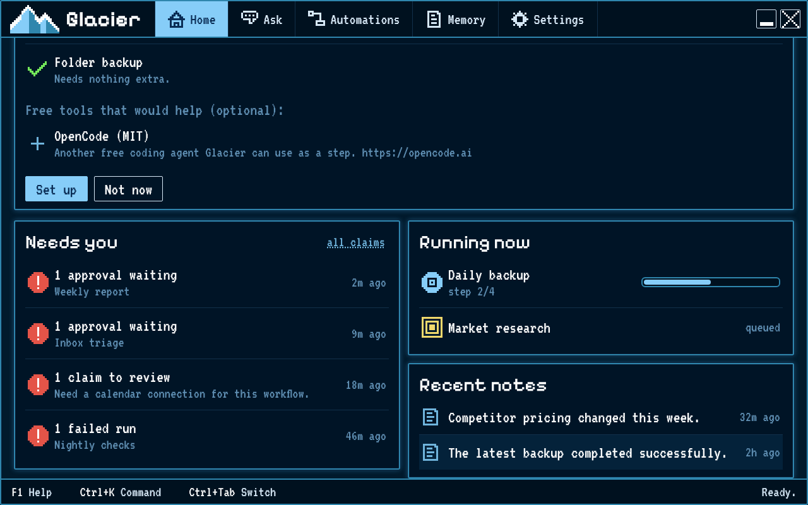

# Approving and rejecting a run

Some automations pause and ask you before continuing. You decide whether the run may follow that step.

## Steps

1. Open **Home**. Runs waiting for you are listed under **Needs you**; select one to open it. Or open **Automations** and select an automation that has an approval step.
2. Choose **Run**.
3. When the run pauses, read the request shown near the top of the screen. Its status says it needs you.
4. Choose **Approve** only if you want the automation to continue along its approved path.
5. Choose **Reject** if you do not want it to continue that way. The run stops that path and shows **Rejected**.

## How you know it worked

After **Approve**, the run continues past the waiting step. After **Reject**, the run shows **Rejected** and the steps on the approved path are skipped.
