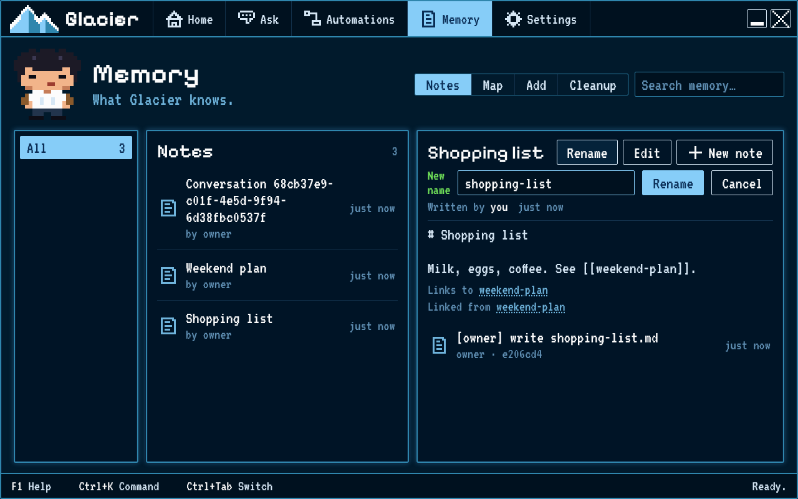

# Your memory: notes, links, and past chats

Memory keeps notes on this computer. You can link related notes, rename a note, and undo a saved change.

## Steps

1. Open **Memory**, then choose **Notes**.
2. Choose **New note**. Give it a title, write a few words, then choose **Save**.
3. Choose **Edit** on the note. Type `[[` in its text and select a suggested note to add a link. Choose **Save**.
4. Choose **Rename**, enter a new name, then choose **Rename** again. Glacier updates links that point to the note.
5. To undo the rename, choose **Undo** in the message saying **Renamed from…**. To undo a text edit instead, edit the note, save it, then choose **Undo** in the saved message.
6. Open **Ask** and choose **Past chats** to find an earlier conversation. Select one to read it again.

## How you know it worked

The renamed note appears under its new name, and its links still open it. **Undo** restores the earlier name or note text. **Past chats** shows saved conversations you can reopen.
