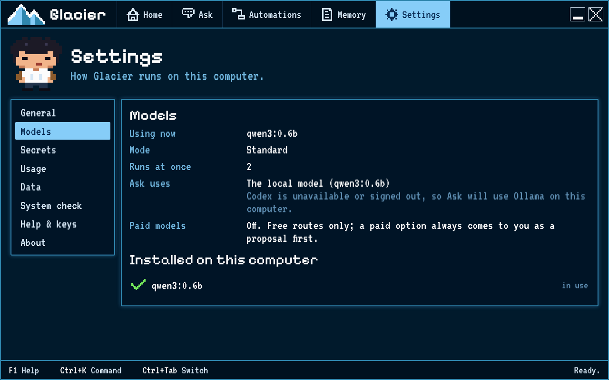

# Working offline or on a small computer

Check which assistant route and local model Glacier is set to use. A small local model can work on modest hardware, though answers may take longer or be less complete.

## Steps

1. Open **Settings**, then choose **Models**.
2. Read **Ask uses**. It tells you whether Ask uses Codex with your ChatGPT plan or a local model on this computer.
3. Under **Installed on this computer**, check whether Glacier lists a local model. If it says **No local models yet**, Ask cannot use a local model offline.
4. Open **Settings**, then choose **General**. Read **Mode**. **Light** means one run at a time with a small model; **Standard** allows more runs at once.
5. If the screen recommends **Light**, remember that tasks may take longer and small models may give shorter or less accurate answers. Check results before relying on them.
6. Disconnecting the internet does not make an online assistant available offline. Ask can work offline only when its local model is installed and ready.

## How you know it worked

**Ask uses** names the route currently selected, and **Installed on this computer** shows any local models Glacier found. You know whether this computer has a local option before you try to work without internet.
